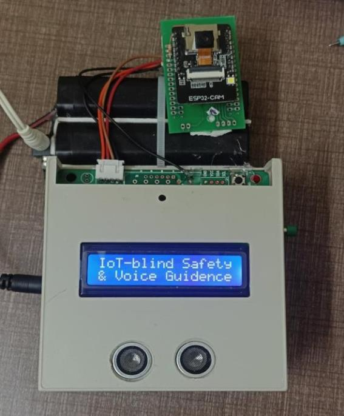
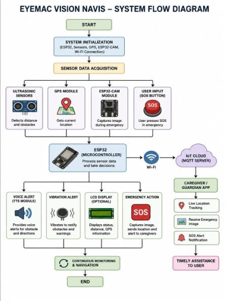
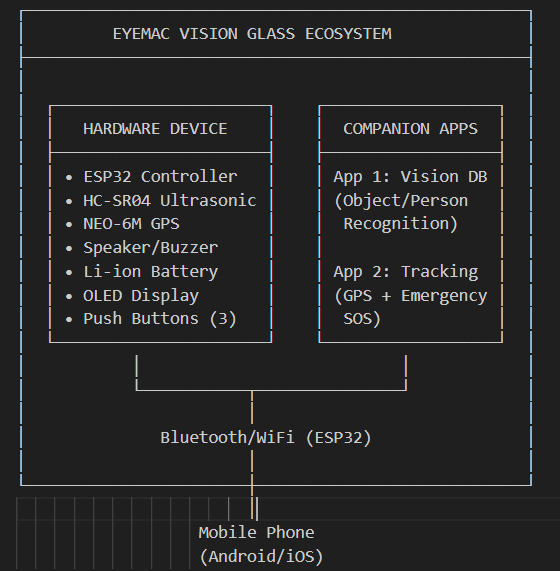

# EYEMAC VISION NAVIS

Affordable smart assistive wearable for visually impaired users: real-time obstacle detection, voice navigation prompts, GPS tracking and emergency location sharing with caregivers.

> Innovative Design Project, B.E. Instrumentation and Control Engineering, Sri Sairam Engineering College, Chennai (May 2026).
> Team: Venkatsubramanyam V, Dilli Ganesan K, Naveen Kumar T. Supervisor: Ms. S. Gowriswari.
> Status: prototype in progress.

## Problem
White canes miss overhead and fast-moving obstacles and give no guidance in unfamiliar places. Imported smart glasses (OrCam, Envision) cost far too much for most users in India. Eyemac targets a price of about Rs. 25,000 using widely available modules.

## Features
- Ultrasonic (HC-SR04) obstacle detection with graded alerts based on distance
- Spoken / buzzer / vibration prompts such as "move left", "move right", "walk straight", "stop - obstacle detected"
- GPS (NEO-6M) latitude-longitude tracking, shared as a Google Maps link
- Panic / SOS button; ESP32-CAM captures and emails an emergency image
- Status shown on a 16x2 I2C LCD
- MQTT cloud link for the caregiver / tracking app
- Two companion apps (planned): Vision DB for object/person recognition data, and Tracking & SOS

## Hardware
ESP32, ESP32-CAM (AI-Thinker), HC-SR04 ultrasonic sensor, NEO-6M GPS, buzzer / vibration motor, 16x2 LCD (I2C, address 0x27), push buttons, Li-ion battery. Raspberry Pi 5 with an AI camera is being integrated for future recognition.

## Repository layout
| Path | What it is |
|---|---|
| `firmware/esp32-main/` | Main ESP32 firmware: ultrasonic, GPS over UART2, LCD, MQTT, Wi-Fi config |
| `firmware/esp32-cam/` | ESP32-CAM firmware: photo capture to SPIFFS and email on trigger |
| `firmware/simulation-arduino-uno/` | Tinkercad simulation sketch (distance -> buzzer + motor) |
| `docs/images/` | Block diagram, flow diagram, circuit, simulation, prototype photo |

## Setup
1. Install Arduino IDE (or PlatformIO) with the ESP32 board package.
2. Libraries: TinyGPSPlus, ArduinoJson (v5 API), PubSubClient, LiquidCrystal_I2C, ESP32_MailClient.
3. In `firmware/esp32-main/` and `firmware/esp32-cam/`, copy `secrets.h.example` to `secrets.h` and fill in your own values. `secrets.h` is git-ignored.
4. ESP32-CAM: select an ESP32 board with PSRAM (e.g. ESP32 Wrover Module) and add `camera_pins.h` and `app_httpd.cpp` from the Espressif **CameraWebServer** example.
5. Main firmware: add the project's `helpers.h` and `global.h` (see Known gaps).
6. Flash, then open the serial monitor at 9600 baud.

## Known gaps
- `helpers.h` and `global.h` used by `esp32-main` are not in this repo yet.
- Mobile apps, Raspberry Pi 5 recognition pipeline and integrated field testing are still in progress.
- Obstacle thresholds are distance-based rules (no AI in the alert logic).

## Demo
[Add demo video link here]

## SDGs
SDG 3 (Good Health and Well-Being), SDG 9 (Industry, Innovation and Infrastructure), SDG 10 (Reduced Inequalities).

## License
[Choose a license before making this repo public]
